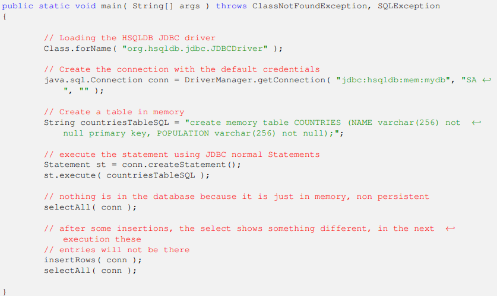
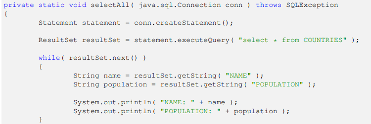

# sql

## Basics

### Logar
mysql -u root -p 
### Mostrar BD's
show databases;
### Criar um BD
create database hostelapp_db;
### Selecionar um BD
use <nome>

## JDBC

### setup
In order to connect to a database we need to use a java.sql.Connection object. We can do this using the getConnection()

//MySQL driver is loaded
Class.forName( "com.mysql.jdbc.Driver" );
//Connection object is created using the db host and credentials
Connection connect = DriverManager.getConnection("jdbc:mysql://localhost/countries?" + "user=root&amp;password=root" );

### commit
DBC connection supports two different ways of working:
autocommit=true and autocommit=false. The first one commits all transactions directly to the database, the second one needs an special command in order to commit or rollback the transactions

### DriverManager
The DriverManager class is in charge of loading the proper database, after this is loaded, the code that access the database for querying
and modifying data will remain (more or less) unchanged.

### Exemple

  

  

